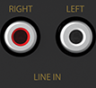
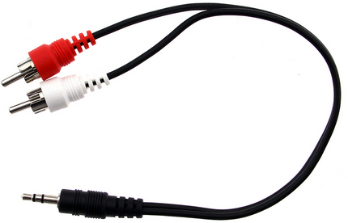
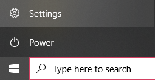
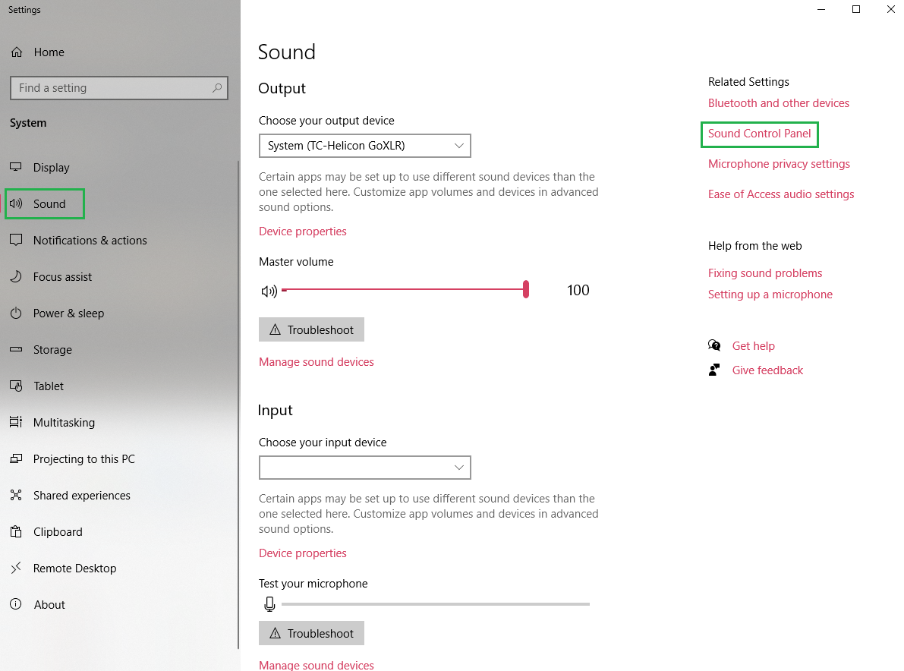
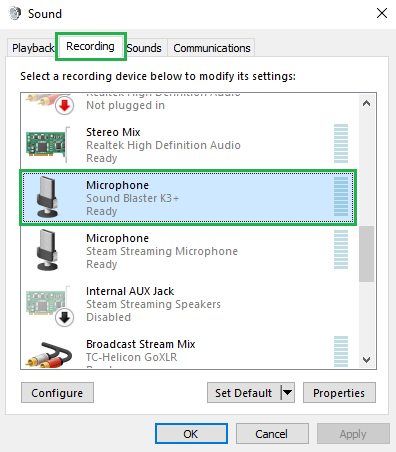
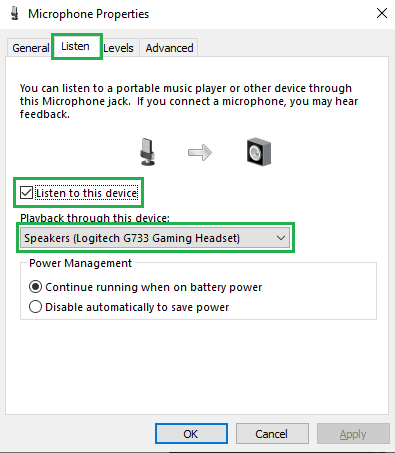
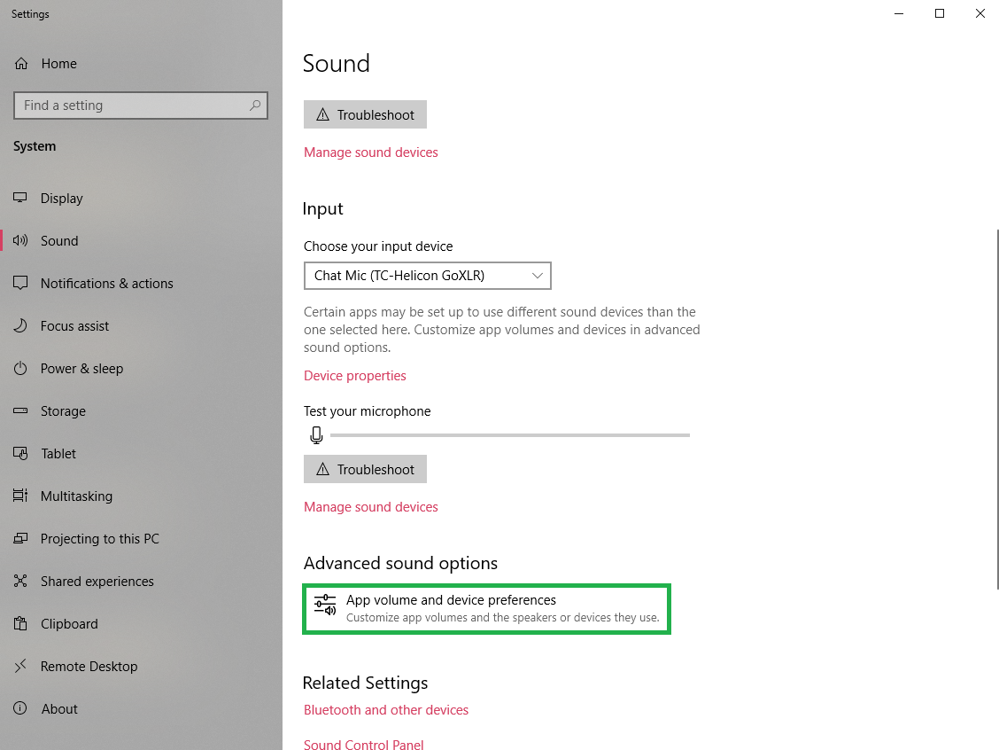
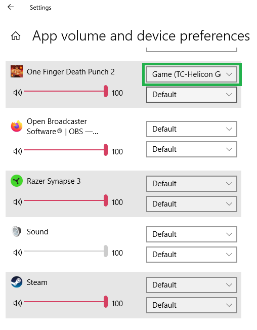

# Using a USB headset with a GoXLR

As long as you have a free line-in audio jack on your computer (or can purchase and attach one) you can use any headset with your GoXLR, even wireless headets with a USB dongle.

I am using a Creative Sound Blaster K3+ for my line-in device and a Logitech G733 Lightspeed Wireless Headset as my headset. This would also work for headsets that plug directly into USB, such as the Razer Kraken Kitty.

## Setup

### Line-In

This setup requires a working physical line-in jack on your computer. Most desktop computers have a line-in built into them. The jack usually looks something like this:

If your computer doesn't have a free line-in jack but does have a free USB port you can get a device which will work as a Line In.

If you don't even have a free USB port you can get a USB hub to give you more ports, but this only works to a certain extent as your computer's USB controller has a limited amount of resources and all of the devices you pluig into the hub have to share the bandwidth of the one USB jack on your computer. Too many devices on one port can overload your system, just like plugging in too many power plugs to a single power strip can cause problems.

### Cabling

Any existing cabling and setup you're using with your GoXLR can stay as-is except for what is plugged into the headphone jack. Unplug your headphones from the GoXLR's headphone hack and plug in a 3.5mm audio cable instead.

Warning: *DO NOT* plug the other end of this cable into your GoXLR's line-in jack. If you are sending the line-in output to the headphones output you will cause severe distortion and potentially damage your GoXLR.

Plug the other end of the 3.5mm audio cable into your free line-in jack. On the Sound Blaster K3+ I plugged this into the Mobile I/O jack.

If your line-in device has two RCA jacks instead (the Sound Blaster K3+ has this for its line-in input) you can instead use a mini-y adapter cable (3.5mm jack on one end, two RCA jacks on the other end).

Warning: The quality of the line-in device and the cables you use will affect the quality of the audio. While this won't affect your GoXLR output to a recording or a stream you may hear extra noise through your heapdhones. Many built-in audio jacks on a computer are relatively noisy and can introduce an extra hiss or static to the audio. Once you have your setup working you may want to invest in a higher quality line-in device if you're hearing extra noise. Alternatively you might try a ground loop isolater inline with the cable to reduce noise, although this can also have an effect on audio quality. I have found that a ground loop isolater can be very effective at reducing noise between multiple powered devices, especially if they are USB powered.

### Computer Setup

Now that you have things wired up, all you need to do is send the line-in audio to your headset. Windows has built-in support to "listen" to an input on any output. I will be giving instructions for Windows 10 computers, other OSes and Windows versions may be different.

Open your Settings app by clicking the Windows menu, then choosing Settings.

Choose the Sound panel on the left side of the Settings app, then click Sound Control Panel under Related Settings on the right side.

Choose the Recording tab on the top, then scroll down to your line-in device and double-click on it (or select it then press the Properties button). For the Sound Blaster K3+ this is listed as a Microphone.

Choose the Listen tab, then check the "Listen to this device" checkbox and select your headset in the "Playback through this device" dropdown.

Now click the Apply button and you should start hearing your GoXLR's headphone output in your headset. You can now close all of the properties and settings windows.

That's it! Your GoXLR headphones output is now going to your wireless headset. You can use the Headphones volume control on your GoXLR (or in its app) to control your headset volume and you can use the Routing system in the GoXLR app to choose what outputs you head separate from what goes to your Broadcast Stream Mix.

This setup will work just fine with your headset but you can also change the device you're outputting to. For instance if you switch between headphones and speakers you can just go to the line in properties dialog again and switch to your other device.

## Extras

### Volume Controls

You probably already know this if you've used a GoXLR for any preiod of time but any volume controls on your keyboard (or on a headset such as the Logitech G733 and Razer Kraken Kitty) will only affect the output chosen as the default output in the Windows Sound Settings. This means that if you have your default sound output set to the GoXLR System channel and use these volume controls you will only affect the volume of your System channel going into the GoXLR. The overall volume of your headphones can only be controlled via your GoXLR's Headphones volume control in this setup. In general I would recommend leaving your volume on all of your channels at the maximum you can get to without distortion and only use your GoXLR to change the various volume levels.

### My Settings

I thought I would includs some additional details of how I have things set up in case they help.

In my Sound Settings I have the GoXLR's System channel selected for my default sound device. This makes any program which isn't specifically set to use a certain output to use the System channel on your GoXLR. I would *not* recommend setting your default audio output device to your headset or speakers as your GoXLR will not receive the output and you may not hear the audio you expect depending on the rest of your audio setup.

## Application Audio Output

### In-Game Output Settings

If you're playing a game which supports setting the output device specifically you can set this to the GoXLR Game channel so you can control its volume separately. If the game does not support setting the audio channel specifically within its settings you have multiple other options.

### Windows App Volume and Device Preferences

Windows has support for changing the output device of individual programs in the "App volume and device preferences" area under "Advanced sound options" at the bottom of the Sound screen in the Settings app.

If your game (or other application) supports the Windows built-in app-specific audio settings (should be the case for many games and other programs, such as browsers) you can change the output device here for just your application and it should immediately switch.

If the sound from your application does not switch right away try closing the application and starting it up again and see if the output is in the right place after that.

These settings are persistent so if you close the app and start it up again (even after a reboot) it should still have the specific audio device you chose selected.

### Bait-and-Switch

If your game (or application) does not support these Windows options it may end up using the Default device instead of the one you chose in Windows Settings, even if the app is restarted (Hollow Knight does this for me, for instance). In this instance you may be able to trick it into outputting to another channel.

Change your default output device in the Windows Sound Settings to the channel you want the game to use (such as the GoXLR Game channel).

Start up the game (such as Hollow Knight).

Change your default output device back to the GoXLR System channel.

Now your game will be using the Game channel but your other applications should be using the System channel, just like you wanted.

## Other Audio Programs

You can also use any number of third-party programs to connect the input to your headset or another output.

### Voicemeeter

I use the free Voicemeeter program instead of the built-in Windows "Listen to this device" as it has a nicer UI for switching between devices (who wants to click through 3 levels of Windows settings all the time) and also has options such as sending the input to multiple devices (you could output to both your headset and speakers and just mute one or the other depending on which you want to use) as well as many other controls.

Note that if you are using Voicemeeter it may take full control of your audio output device, so if you, for instance, try to set your headset as your default audio device as well as using it as an output in Voicemeeter you are likely to only hear the audio from Voicemeeter and not from any other applications.

### Open Broadcaster Software (OBS)

If you stream or record you likely know about OBS. It is also possible to use its audio monitoring system to listen to some audio channels and output others. This will also work just as well as Voicemeeter or the Windows built-in listen support to let you listen to the line-in input but if you are also recording or streaming this may interfere with or complicate your sound setup.
